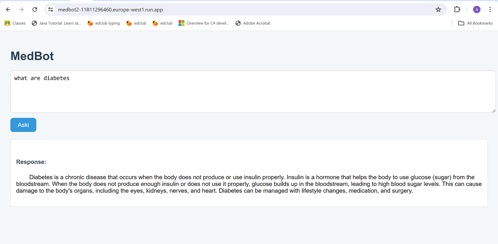

# 🩺 MedBot – AI-Powered Medical Chatbot

MedBot is an **AI-powered web application** that provides interactive medical Q&A using a fine-tuned **TinyLLaMA model with LoRA adapters**.  
The chatbot runs on **Flask**, is **Dockerized** for easy deployment, and is live on **Google Cloud Run**.

## 📌 Features

- ✅ Medical chatbot powered by **TinyLLaMA + LoRA adapter**
- ✅ Web interface using **Flask (HTML/CSS frontend)**
- ✅ **Dockerized** for reproducible deployment
- ✅ **Deployed live** with a public link
- ✅ Hugging Face integration for model + adapter
- ✅ Beginner-friendly setup and documentation

## 🧠 Model Information

- **Base Model**: [TinyLLaMA](https://huggingface.co/TinyLlama)
- **LoRA Adapter**: Fine-tuned for medical Q&A  
- **Tokenizer**: SentencePiece tokenizer

⚠️ The model and adapter are **large files (~10GB)**, so they are **not included in this repository**.  
Instead, please download them from Hugging Face:

### 🔗 Download Links
- [adapter_config.json](https://huggingface.co/AIAMAL25/tinyllama_medbot_lora/blob/main/adapter_config.json)  
- [adapter_model.safetensors](https://huggingface.co/AIAMAL25/tinyllama_medbot_lora/blob/main/adapter_model.safetensors)

### Expected Folder Structure

MEDBOT2/
├── adapters/tinyllama\_medbot\_lora/
│   ├── adapter\_config.json
│   └── adapter\_model.safetensors
├── models/tinyllama\_transformers/
│   └── (base TinyLLaMA model files)

## 🖥️ Flask Application

- **`app.py`** → Main application file  
- **`templates/index.html`** → Web UI for user input/output  
  

Users can type medical questions and receive model-generated answers.

## 🐳 Dockerization

The entire app is containerized for easy deployment.

### Build Docker Image

docker build -t medbot .

### Run Docker Container

docker run -p 5000:5000 medbot

Now open: [http://localhost:5000](http://localhost:5000) 

## 🌍 Deployment

MedBot is live on **Google Cloud Run**:
👉 [https://medbot2-11811296460.europe-west1.run.app](https://medbot2-11811296460.europe-west1.run.app)

## ⚙️ Local Setup Instructions

1. Clone this repository:

   
   git clone https://github.com/Amal-ai25/MEDBOT2.git
   cd MEDBOT2
  

2. Download the model + adapter files (see above) and place them inside `models/` and `adapters/`.

3. Install Python dependencies:

   pip install -r requirements.txt
   

4. Run Flask locally:

   python app.py
  

5. Open in your browser:
   👉 [http://localhost:5000](http://localhost:5000)

##  Preview

Below is a screenshot of MedBot in action:

## 🚧 Known Issues

* Large model (\~10GB) requires strong compute (GPU recommended).
* Cold start delays when deployed on free-tier cloud hosting.
* Limited to **text-only input/output** (no speech or multimodal yet).

## 🏆 Extra Mile (GitHub Bonus)

This repo includes:

* 📘 Clear instructions
* 🐳 Dockerization
* 🖼️ Screenshot of demo
* 🔗 Hugging Face links (instead of giant files)

Making it **beginner-friendly and reproducible** for anyone who wants to run MedBot locally.

## 👨‍💻 Author

* **Name**: Amal cheikh Ali
* **GitHub**:[Amal-ai25](https://github.com/Amal-ai25)
* **Hugging Face**: [AIAMAL25](https://huggingface.co/AIAMAL25)

